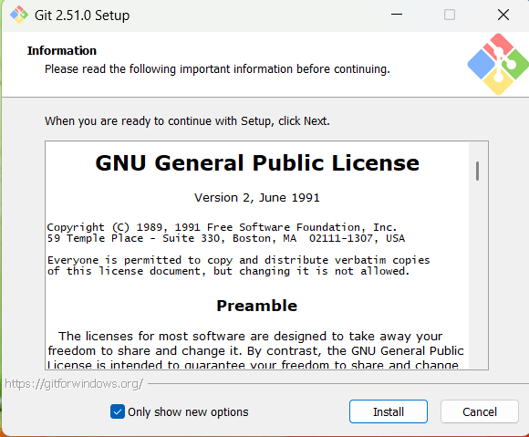
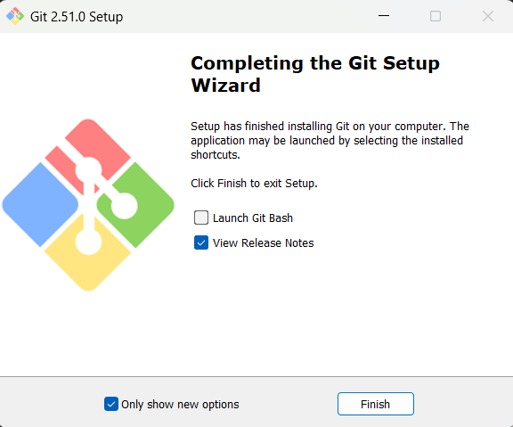

# Ejecución

1. Abra el archivo inicio.html
2. Se debe visualizar una web en la que puede navegar por las diferentes opciones del menú.

## Instalación

1. Abra la url https://git-scm.com/
2. Descargue el archivo 
3. Abra el archivo Git-2.51.0-64-bit.exe
   

5. Dar click en install
6. 

8. Dar click en finish
